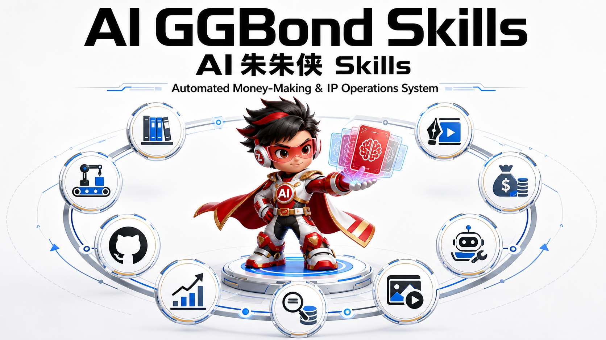

# AI GGBond Skills<br><small>专注让 AI 成为你的自动化搞钱和IP运营系统</small>

<p align="center">
  <a href="https://github.com/BetterZflyee/ai-ggbond-skills/stargazers"></a>
  <a href="https://github.com/BetterZflyee/ai-ggbond-skills/blob/main/LICENSE"></a>
  <a href="https://zflyee.com/"></a>
  <a href="#changelog"></a>
  <a href="README.md"></a>
</p>

<p align="center">
  
</p>

> **为 AI Native 超级个体&OPC打造的 Agent Skills 技能集合。**
>
> 每个技能都是一个完整的自动化工作流——不是聊天玩具，是能发文章、能运营社媒、能抓趋势、能沉淀知识的 AI 劳动力。即插即用，持续迭代，所有经验教训沉淀在 `references/` 目录中。

---

## 为什么选择 AI GGBond Skills

本技能库可运行在 [Hermes Agent](https://github.com/NousResearch/hermes-agent)、[Claude Code](https://claude.ai)、[Codex](https://github.com/openai/codex)、[OpenClaw](https://github.com/nousresearch/openclaw) 等主流 AI Agent 平台之上。所有技能都支持**用户记忆与对话适配**——自动读取你的偏好和历史，实现千人千面的个人化定制，谁用谁知道。

你可以自由选择底层模型——OpenAI、DeepSeek、OpenRouter 200+ 模型、Nous Portal、或是你自己的部署——模型随你换，技能不用改。

---

## 技能矩阵

| 技能 | 分类 | 核心能力 |
|:---|:---|:---|
| `ai-ggbond-article-writer` | 📝 创作 | 公众号长文全流水线：选题→大纲→初稿→排版→配图→发布 |
| `ai-ggbond-post-to-wechat` | 🚀 发布 | 一键推送微信公众号草稿箱，API + Browser CDP 双模式 |
| `ai-ggbond-sticker-writer` | 🎨 创作 | 内容转小红书风微信贴图，自动总结→排版→配图 |
| `ai-ggbond-poster-portrait` | 🎨 创作 | GPT Image 2 女性肖像海报生成——摄影感、电影感、情绪感，安全审核绕过 |
| `ai-ggbond-worldcup-kv-poster` | 🎨 创作 | 世界杯国家概念 KV 海报——把国家当品牌，高级商业体育海报质感 |
| `ai-ggbond-skill-matrix` | 🧭 元技能 | 181 个 Skill 元路由表，7 大场景×22 分类，触发词映射+链式工作流编排 |
| `ai-ggbond-github-trending` | 🔍 研究 | GitHub Trending 抓取+AI 解读，AI/Agent/MCP 趋势洞察 |
| `ai-ggbond-x-followings-feed` | 📡 信号 | X/Twitter 关注流抓取 + AI 结构化日报 + 策展评分 |
| `ai-ggbond-publish-to-x` | 📢 社媒 | X/Twitter 全功能发布：短帖、引用、长文、Thread |
| `ai-ggbond-run-xiaohongshu` | 📕 社媒 | 小红书全链路运营：定位→选题→生产→发布→评论→复盘 |
| `ai-ggbond-brain-setup` | 🧠 知识 | GBrain 记忆层集成：让 AI 拥有长期记忆和知识检索 |
| `ai-ggbond-remove-ai-marks` | 🧹 工具 | 清除 AI 生成图片的可见水印（Gemini火花）和不可见标记（SynthID/C2PA） |
| `ai-ggbond-youtube-script` | 🎬 媒体 | YouTube 字幕/封面下载：InnerTube API + yt-dlp + 三方摘要三级容灾 |

> 所有技能均支持 **"千人千面"用户适配**（v1.0 里程碑）——自动读取 Hermes Memory 中的用户画像，输出贴合你个人风格的内容，而不是千篇一律的 AI 味。

---

## 系统架构

### 技能生态全景图

```
┌─────────────────────────────────────────────────────────────────────────────┐
│                           AI GGBond Skills                                   │
│                      (13 Skills × 7 大分类)                                   │
├─────────────────────────────────────────────────────────────────────────────┤
│                                                                             │
│  ┌─────────────────────────────────────────────────────────────────────┐   │
│  │                        🧭 元技能层                                    │   │
│  │  skill-matrix ──→ 将任务路由到正确的技能链                             │   │
│  └─────────────────────────────────────────────────────────────────────┘   │
│                                    │                                        │
│                                    ▼                                        │
│  ┌──────────────────────┐  ┌──────────────────┐  ┌───────────────────────┐ │
│  │    📡 信号采集层       │  │  🧠 记忆层        │  │    🔍 研究层           │ │
│  │                      │  │                  │  │                       │ │
│  │  x-followings-feed   │  │   brain-setup    │  │   github-trending     │ │
│  │  (X/Twitter 日报)    │  │   (GBrain 知识库) │  │   (开源趋势扫描)       │ │
│  └──────────┬───────────┘  └────────┬─────────┘  └───────────┬───────────┘ │
│             │                       │                        │             │
│             └───────────────────────┼────────────────────────┘             │
│                                     │                                       │
│                                     ▼                                       │
│  ┌─────────────────────────────────────────────────────────────────────┐   │
│  │                     📝 内容创作层                                     │   │
│  │                                                                      │   │
│  │  ┌─────────────┐  ┌──────────────┐  ┌─────────────────────────────┐ │   │
│  │  │ article-    │  │ sticker-     │  │ 视觉内容                    │ │   │
│  │  │ writer      │  │ writer       │  │                             │ │   │
│  │  │ (长文写作)   │  │ (图片卡片)   │  │  poster-portrait            │ │   │
│  │  └──────┬──────┘  └──────┬───────┘  │  (肖像海报)                 │ │   │
│  │         │                │          │                             │ │   │
│  │         │                │          │  worldcup-kv-poster          │ │   │
│  │         │                │          │  (世界杯 KV 海报)            │ │   │
│  │         │                │          └─────────────┬───────────────┘ │   │
│  └─────────┼────────────────┼────────────────────────┼─────────────────┘   │
│            │                │                        │                      │
│            ▼                ▼                        ▼                      │
│  ┌─────────────────────────────────────────────────────────────────────┐   │
│  │                     🚀 多渠道发布层                                   │   │
│  │                                                                      │   │
│  │  ┌──────────────┐  ┌──────────────┐  ┌─────────────────────────────┐│   │
│  │  │ post-to-     │  │ publish-to-x │  │ run-xiaohongshu             ││   │
│  │  │ wechat       │  │              │  │ (全链路运营，内置发布)        ││   │
│  │  │ (微信公众号)  │  │ (X/Twitter)  │  │                             ││   │
│  │  └──────────────┘  └──────────────┘  └─────────────────────────────┘│   │
│  └─────────────────────────────────────────────────────────────────────┘   │
│                                                                             │
│  ┌─────────────────────────────────────────────────────────────────────┐   │
│  │                      🧹 工具层                                       │   │
│  │                                                                      │   │
│  │  ┌──────────────────┐  ┌──────────────────────────────────────────┐ │   │
│  │  │ remove-ai-marks  │  │ youtube-script                          │ │   │
│  │  │ (水印清除)       │  │ (字幕/封面下载)                          │ │   │
│  │  └──────────────────┘  └──────────────────────────────────────────┘ │   │
│  └─────────────────────────────────────────────────────────────────────┘   │
│                                                                             │
│  ┌─────────────────────────────────────────────────────────────────────┐   │
│  │                   🎯 用户画像适配层                                    │   │
│  │                  (Hermes Memory / 用户画像)                           │   │
│  │        自动读取你的风格、定位、偏好，输出千人千面                       │   │
│  └─────────────────────────────────────────────────────────────────────┘   │
└─────────────────────────────────────────────────────────────────────────────┘
```

### 工作流链式组合

每个技能既可独立使用，也可串联成自动化流水线：

#### 内容生产流水线

```
┌─────────────────────────────────────────────────────────────────────┐
│                      主线内容生产流水线                               │
│                                                                      │
│  信号源                  内容创作                 分发渠道            │
│  ──────                 ────────                 ────────           │
│                                                                      │
│  x-followings-feed ──┐                                               │
│                      ├──→ article-writer ──→ post-to-wechat          │
│  github-trending ────┘        │                                      │
│                               │                                      │
│                               ├──→ sticker-writer ──→ (手动分享)      │
│                               │                                      │
│                               └──→ publish-to-x                      │
│                                                                      │
└─────────────────────────────────────────────────────────────────────┘
```

#### 视觉内容流水线

```
┌─────────────────────────────────────────────────────────────────────┐
│                      视觉内容生产流水线                               │
│                                                                      │
│  article-writer ──→ poster-portrait (封面图)                         │
│                                                                      │
│  article-writer ──→ worldcup-kv-poster (赛事主题封面)                 │
│                                                                      │
│  article-writer ──→ sticker-writer (社交卡片)                        │
│                                                                      │
│  poster-portrait ──→ remove-ai-marks ──→ 发布                        │
│                                                                      │
└─────────────────────────────────────────────────────────────────────┘
```

#### 研究与记忆流水线

```
┌─────────────────────────────────────────────────────────────────────┐
│                      研究与知识沉淀流水线                             │
│                                                                      │
│  github-trending ──→ article-writer ──→ brain-setup (知识灌入)        │
│                                                                      │
│  x-followings-feed ──→ article-writer ──→ brain-setup (知识灌入)      │
│                                                                      │
│  youtube-script ──→ article-writer (参考素材)                        │
│                                                                      │
│  brain-setup ──→ article-writer (召回知识)                           │
│                                                                      │
└─────────────────────────────────────────────────────────────────────┘
```

#### 全栈运营流水线

```
┌─────────────────────────────────────────────────────────────────────┐
│                      全栈运营流水线                                   │
│                                                                      │
│  小红书运营：                                                        │
│  run-xiaohongshu ──→ (内部：选题→内容→发布)                           │
│       ↑                                                              │
│       └── brain-setup (用户定位适配)                                  │
│                                                                      │
│  X/Twitter 全闭环：                                                  │
│  x-followings-feed ──→ publish-to-x (热点快评)                       │
│       │                                                              │
│       └── article-writer ──→ publish-to-x (长文)                     │
│                                                                      │
│  多平台联发：                                                        │
│  article-writer ──┬──→ post-to-wechat (主发)                         │
│                   ├──→ sticker-writer ──→ run-xiaohongshu             │
│                   └──→ publish-to-x (交叉分发)                       │
│                                                                      │
└─────────────────────────────────────────────────────────────────────┘
```

### 完整技能组合矩阵

| 源技能 | → 目标技能 | 使用场景 |
|:---|:---|:---|
| `x-followings-feed` | `article-writer`, `publish-to-x` | 信号 → 文章或热点快评 |
| `github-trending` | `article-writer` | 开源项目 → 趋势文章 |
| `youtube-script` | `article-writer` | 视频字幕 → 文章参考素材 |
| `article-writer` | `post-to-wechat` | 长文 → 微信公众号发布 |
| `article-writer` | `publish-to-x` | 长文 → X 推文或长帖 |
| `article-writer` | `sticker-writer` | 文章 → 社交图片卡片 |
| `article-writer` | `poster-portrait` | 文章 → 电影感封面图 |
| `article-writer` | `worldcup-kv-poster` | 文章 → 赛事主题 KV 海报 |
| `article-writer` | `brain-setup` | 知识 → 长期记忆沉淀 |
| `article-writer` | `run-xiaohongshu` | 文章 → 小红书内容 |
| `poster-portrait` | `remove-ai-marks` | 生成图 → 清洗后发布 |
| `worldcup-kv-poster` | `remove-ai-marks` | 生成图 → 清洗后发布 |
| `sticker-writer` | `remove-ai-marks` | 生成图 → 清洗后发布 |
| `run-xiaohongshu` | `brain-setup` | 互动数据 → 记忆沉淀 |
| `brain-setup` | `article-writer`, `sticker-writer`, `run-xiaohongshu` | 记忆 → 千人千面输出 |
| `skill-matrix` | ALL | 任务路由 → 技能链选择 |

---

## 快速安装

### 通用安装（所有平台通用）

技能本质是标准的 `SKILL.md` 文件 + `references/` 目录，复制到你的 AI Agent 技能目录即可：

```bash
# 克隆仓库
git clone https://github.com/BetterZflyee/ai-ggbond-skills.git /tmp/ai-ggbond-skills

# 复制技能到你的 Agent 技能目录
# 将 <SKILL_DIR> 替换为你的平台技能路径（见下方各平台说明）
cp -r /tmp/ai-ggbond-skills/skills/ai-ggbond-* <SKILL_DIR>/
```

### 各平台安装指南

#### Hermes Agent

```bash
# 技能目录：~/.hermes/skills/
cp -r /tmp/ai-ggbond-skills/skills/ai-ggbond-* ~/.hermes/skills/

# 验证安装
hermes skills list | grep ai-ggbond

# 更新技能
cd /tmp/ai-ggbond-skills && git pull
cp -r skills/ai-ggbond-* ~/.hermes/skills/
```

#### Claude Code

```bash
# 技能目录：~/.claude/skills/ 或项目 .claude/skills/
mkdir -p ~/.claude/skills
cp -r /tmp/ai-ggbond-skills/skills/ai-ggbond-* ~/.claude/skills/

# 或安装到特定项目
mkdir -p /path/to/your/project/.claude/skills
cp -r /tmp/ai-ggbond-skills/skills/ai-ggbond-* /path/to/your/project/.claude/skills/
```

#### Codex (OpenAI)

```bash
# 技能目录：~/.codex/skills/ 或项目 .codex/skills/
mkdir -p ~/.codex/skills
cp -r /tmp/ai-ggbond-skills/skills/ai-ggbond-* ~/.codex/skills/
```

#### OpenClaw

```bash
# 技能目录：~/.openclaw/skills/
mkdir -p ~/.openclaw/skills
cp -r /tmp/ai-ggbond-skills/skills/ai-ggbond-* ~/.openclaw/skills/
```

#### 通用 Agent（自定义）

```bash
# 任何支持从技能目录读取 SKILL.md 的 Agent
# 只需复制到你的 Agent 指定的技能路径
cp -r /tmp/ai-ggbond-skills/skills/ai-ggbond-* /your/agent/skill/path/
```

### 按需安装单个技能

```bash
# 只安装你需要的技能
cp -r /tmp/ai-ggbond-skills/skills/ai-ggbond-article-writer <SKILL_DIR>/
cp -r /tmp/ai-ggbond-skills/skills/ai-ggbond-post-to-wechat <SKILL_DIR>/
```

### 更新所有技能

```bash
cd /tmp/ai-ggbond-skills && git pull
cp -r skills/ai-ggbond-* <SKILL_DIR>/
```

---

## 使用指南

### 自然语言触发（推荐）

在对话中直接说话即可——技能通过意图识别触发，不需要命令：

| 你对 AI 朱朱侠说 | 自动触发 |
|:---|:---|
| "写一篇关于 AI Agent 的文章" | `ai-ggbond-article-writer` |
| "发到微信公众号" | `ai-ggbond-post-to-wechat` |
| "把这个转成贴图" | `ai-ggbond-sticker-writer` |
| "生成肖像海报" / "CCD风格照片" | `ai-ggbond-poster-portrait` |
| "世界杯海报" / "国家KV海报" | `ai-ggbond-worldcup-kv-poster` |
| "我该用哪个skill" / "帮我选skill" | `ai-ggbond-skill-matrix` |
| "看看 GitHub Trending 今天有什么" | `ai-ggbond-github-trending` |
| "X 日报" / "总结关注列表" | `ai-ggbond-x-followings-feed` |
| "发推" / "publish to X" | `ai-ggbond-publish-to-x` |
| "帮我运营小红书" | `ai-ggbond-run-xiaohongshu` |
| "配置 brain" / "灌内容到 gbrain" | `ai-ggbond-brain-setup` |
| "去水印" / "洗图" / "清除AI标记" | `ai-ggbond-remove-ai-marks` |
| "YouTube字幕" / "YouTube封面" / "获取字幕" | `ai-ggbond-youtube-script` |

### CLI 命令参考

```bash
# 查看已安装的全部技能
hermes skills list

# 只看 AI GGBond 系列
hermes skills list | grep ai-ggbond

# 查看某个技能的详细文档
hermes skills view ai-ggbond-article-writer

# 更新 Hermes Agent 本体
hermes update

# 诊断问题
hermes doctor
```

---

## 技能详览

### ai-ggbond-article-writer

公众号长文写作全流水线。从 AI Native 超级个体视角输出内容。

**能力**：选题判断 → 大纲框架 → 正文初稿 → 语义节奏排版 → AI 配图 → 推送到微信草稿箱

**特色**：
- Anthropic 暖米白 + Tech Blue v3 双排版主题
- 信息图自动生成（课程表隐喻、陶土橙 / 鼠尾草绿配色）
- 图片 OCR 质检、金句断点、引用框规范
- 支持"千人千面"用户适配——根据你的定位自动调整文风和深度

### ai-ggbond-post-to-wechat

将文章推送到微信公众号草稿箱。

**双模式**：
- **API 模式**（推荐）：AppID + AppSecret，快速可靠
- **Browser CDP 模式**（备用）：直连 Chrome 扫码登录，绕过敏感词拦截

**自动处理**：正文图片上传、封面图提取、HTML 样式注入、Tailscale 出口 IP 适配

### ai-ggbond-sticker-writer

将文章或要点转换为微信贴图（小红书风格）。

**流程**：输入内容 → 自动总结提炼 → 标题生成 → Markdown 排版 → AI 配图生成

**样式**：知识卡片、清单体、对比图、步骤图、观点卡

### ai-ggbond-poster-portrait

GPT Image 2 女性肖像海报生成系统——摄影感、电影感、情绪感的高质量人像海报。

**能力**：电影感人像生成 · CCD 街拍风格 · 情绪感写真 · 安全审核绕过的 prompt 工程（结构化网格 > 叙述性段落）· 云雾 API 直接对接，生成稳定可靠

**特色**：
- 结构化网格/表格布局 prompt，防止模型"自由发挥"偏离内容
- 多种摄影风格：CCD、胶片颗粒、街拍、影棚
- 肖像专用负面提示词，确保质量一致
- 绕过脚本 ContentAnalyzer 直接调 API 的工作流

### ai-ggbond-worldcup-kv-poster

世界杯国家概念 KV 海报生成系统——把每个国家当成一个完整的视觉品牌来设计。

**能力**：国家视觉资产自动识别 · 球星/足球宝贝形象整合 · 多画幅比例支持（9:16、16:9、4:5、1:1、2.35:1）· 高级商业体育海报质感 · 高辨识度设计语言

**特色**：
- 不是国旗+足球的拼凑——是完整的品牌视觉识别设计
- 自动识别国家配色、文化符号、字体风格
- 支持球星肖像和品牌吉祥物两种模式
- 针对社媒传播和商业印刷双重优化

### ai-ggbond-skill-matrix

飞哥的全量 Skill 元路由表——181 个 Skill 按 7 大场景分类的完整索引。

**能力**：181 Skills × 7 大场景 × 22 分类 · 触发词→Skill 映射 · 全链路编排（选题→研究→写作→发布）· 技能链推荐

**使用场景**：
- "我该用哪个 skill？"——扫描矩阵，推荐最佳匹配
- "从选题到发布的全链路"——串联正确的技能链
- "我有哪些技能？"——按场景分类的技能全景图

### ai-ggbond-github-trending

GitHub Trending 趋势发现与解读。

**能力**：daily / weekly / monthly 时间窗 · AI / Agent / MCP / LLM 领域过滤 · P0 / P1 / P2 优先级自动分级 · Markdown 报告 + 选题建议输出

### ai-ggbond-x-followings-feed

X/Twitter 关注流 AI 日报。

**能力**：获取关注列表推文（非推荐算法流）· 单次 200+ 条 · 1 / 3 / 7 天时间窗 · AI 自动分类（重大事件 / 产品发布 / 技术洞察 / 资源汇总 / 舆情信号）· 内置 `curate_and_score.py` 策展评分引擎

### ai-ggbond-publish-to-x

X/Twitter 全功能发布客户端。

**能力**：短帖（文字 + 图片 + 视频）· 引用转发 · 长文（X Articles / Markdown）· 帖子串（Thread）· 对接 article-writer 和 followings-feed 形成内容闭环

### ai-ggbond-run-xiaohongshu

小红书全链路运营。

**能力**：自动读取 Hermes Memory 适配用户定位 → 选题研究 → 内容生产 → 发布执行 → 评论回复 → 爆款复刻 → 复盘沉淀 · CDP 浏览器适配

### ai-ggbond-brain-setup

GBrain 记忆层集成——让 AI 拥有长期记忆。

**能力**：PGLite 本地向量存储 · DashScope text-embedding-v4（Qwen3-Embedding, 1024d）· balanced search mode · 代理感知 fetch（大写 HTTPS_PROXY）· recipe patching 适配国内 key · 9 个已验证踩坑记录与修复方案 · 桥接 signal-detector / brain-ops / conventions 等上游技能 · 知识库内容灌入工作流

### ai-ggbond-remove-ai-marks

清除 AI 生成图片的水印和元数据标记。

**能力**：可见水印清除（Gemini 火花，Alpha 通道反算）· 不可见水印清除（SynthID v1+v2、DWT-DCT，扩散重生成）· 元数据剥离（C2PA/EXIF/XMP）· 批量扫描+清洗 · 对抗 AI 检测的人化处理（胶片颗粒）· 单张图片深度检测

**场景**：发布前的配图清洗（微信/X/小红书）· 批量清洗文章封面图 · 社交平台 AI 检测对抗

### ai-ggbond-youtube-script

YouTube 视频字幕、封面图下载工具。无需 API Key，直接调用 YouTube InnerTube API，自动容灾到 yt-dlp 和三方摘要搜索。

**能力**：多语言字幕下载 · 翻译 · 章节切分 · 说话人识别（AI 后处理）· SRT/文本输出 · 封面图缓存 · 支持自动和手动字幕

**特色**：
- 三级容灾：InnerTube API → yt-dlp → 搜索三方摘要
- 句级时间戳切分（支持 CJK 文本合并）
- 智能缓存——仅在语言切换或 `--refresh` 时重新抓取
- 代理感知，适配网络受限环境（国内、Hermes VM）
- 6 个已验证踩坑记录与解决方案

---

## 集成生态

### 依赖关系

```
ai-ggbond-brain-setup (记忆底座)
        ↓
Hermes Memory (用户画像)
        ↓
┌───────┼──────────┬──────────────┐
↓       ↓          ↓              ↓
article  sticker   xiaohongshu   github
writer   writer    ops           trending
   ↓       ↓          ↓
post-to   publish    (内置发布)
|-wechat   -to-x
```

### 工作流示例

| 工作流 | 技能链 |
|:---|:---|
| 日常信号→文章→发布 | `x-followings-feed` → `article-writer` → `post-to-wechat` |
| 热点快评→X 推文 | `x-followings-feed` → `publish-to-x` |
| 开源项目→选题创作 | `github-trending` → `article-writer` → `post-to-wechat` |
| 知识沉淀→长期记忆 | `article-writer` 产出 → `brain-setup` 灌入 GBrain |
| 文章配肖像海报 | `article-writer` → `poster-portrait` 生成封面 |
| 世界杯内容系列 | `worldcup-kv-poster` → `article-writer` → `post-to-wechat` |
| 多平台联发 | `article-writer` → `post-to-wechat` + `publish-to-x` + `sticker-writer` → `run-xiaohongshu` |
| 视频→文章→发布 | `youtube-script` → `article-writer` → `post-to-wechat` |
| 图片清洗流水线 | `poster-portrait` → `remove-ai-marks` → 发布 |
| 完整研究周期 | `github-trending` + `x-followings-feed` → `article-writer` → `brain-setup` |

---

## 迁移指南

### 从 ai-ggbond-push-to-x 迁移到 ai-ggbond-publish-to-x

`ai-ggbond-push-to-x` 已于 2026 年 5 月 26 日废弃，请使用 `ai-ggbond-publish-to-x`：

```bash
# 1. 删除旧技能
rm -rf ~/.hermes/skills/ai-ggbond-push-to-x

# 2. 安装新技能
cp -r /tmp/ai-ggbond-skills/skills/ai-ggbond-publish-to-x ~/.hermes/skills/social-media/

# 3. 验证
hermes skills list | grep publish-to-x
```

**变化**：新技能 API 向后兼容旧的触发词（"发推""tweet""publish to X"），无需修改使用习惯。新增支持 X Articles 长文 Markdown 发布和 Thread 帖子串。

---

## 更新日志

| 日期 | 里程碑 |
|:---|:---|
| 2026-06-17 | 🎯 `ai-ggbond-poster-portrait` + `ai-ggbond-worldcup-kv-poster` + `ai-ggbond-skill-matrix` 同步上线——肖像海报、世界杯 KV、181 技能路由表 |
| 2026-06-08 | 🎬 `ai-ggbond-youtube-script` 上线 — YouTube 字幕/封面下载，三级容灾（InnerTube + yt-dlp + 三方摘要） |
| 2026-06-04 | 🧠 `ai-ggbond-brain-setup` v1.2 — DashScope/Qwen3-Embedding 支持，9 个踩坑记录，代理配置，recipe patching |
| 2026-05-28 | 🧹 `ai-ggbond-remove-ai-marks` 上线 — AI 图片可见+不可见水印清除 |
| 2026-05-26 | 📦 `ai-ggbond-brain-setup` 上线 · `push-to-x` 废弃，`publish-to-x` 替代 |
| 2026-05-20 | 🔍 `ai-ggbond-github-trending` 上线 · 全部技能达成"千人千面"用户适配 v1.0 |
| 2026-04-20 | 🏗️ 仓库创建，技能体系正式工程化 |
| 2026-02-28 | ✍️ `ai-ggbond-article-writer` 首个技能上线，完成第一篇端到端自动发布 |

---

## 贡献

本仓库为 AI Native 超级个体的实战技能库。每个技能的 `references/` 目录沉淀了真实会话中的踩坑记录和迭代经验——这是本仓库最有价值的部分。

**迭代流程**：实战使用 → 发现问题 → 更新 SKILL.md + references/ → 同步 GitHub

欢迎提 Issue 讨论使用场景，或 Fork 后定制你自己的技能变体。

---

## 关注

<p align="center">
  <table>
    <tr align="center">
      <td><b>微信公众号</b></td>
      <td><b>X / Twitter</b></td>
      <td><b>个人博客</b></td>
    </tr>
    <tr align="center">
      <td></td>
      <td><a href="https://x.com/Zflyee">𝕏 · @Zflyee</a></td>
      <td><a href="https://zflyee.com/">🌐 · zflyee.com</a></td>
    </tr>
  </table>
</p>

---

## 许可

[MIT](LICENSE) · 无任何限制。自由使用、修改、分发。